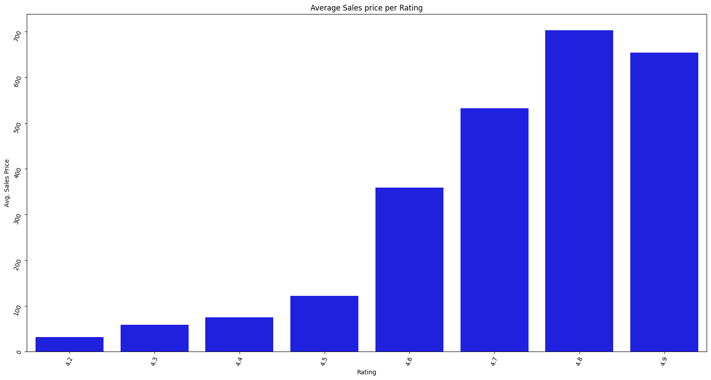
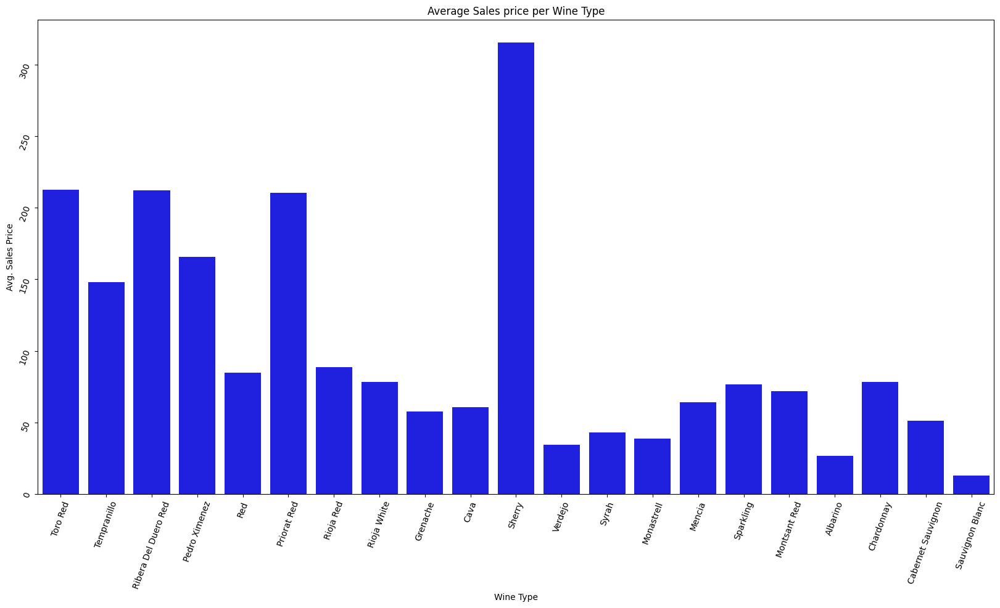

# Predicting the Quality of Spanish Wines

Data Source: https://www.kaggle.com/datasets/fedesoriano/spanish-wine-quality-dataset 

# Overview:

Using the data source provided by Kaggle.com, we need to build a model that can accurately predict the price of a bottle of wine. 

# Data dictionary:

The following list is the data dictionary: 
- winery: Winery name
- wine: Name of the wine
- year: Year in which the grapes were harvested
- rating: Average rating given to the wine by the users [from 1-5]
- num_reviews: Number of users that reviewed the wine
- country: Country of origin [Spain]
- region: Region of the wine
- price: Price in euros [€]
- type: Wine variety
- body: Body score, defined as the richness and weight of the wine in your mouth [from 1-5]
- acidity: Acidity score, defined as wine's “pucker” or tartness; it's what makes a wine refreshing and your tongue salivate and want another sip [from 1-5]

## Removed features:

To build our models, we removed the following features: 
- `winery`, `wine`, `country`, `region`

# Explanatory Data: 

During my analysis of the data, I found two trends to consider when creating models. 

## Trend 1: Higher ratings produce higher prices
There is a moderate correlation between the wine's rating and Price. Higher-rated wines can demand higher prices. In Figure 1, you can see that higher-rated wines (`4.8-4.7`) are significantly more expensive than lower rated wines.

## Trend 2. Sherry commands the highest price.
Sherry has the highest average price of all wine types. See figure 2. The second most expensive wine is almost half the price.

#Initial Findings

## Regression Model tuning and Testing
All models performed less than ideal. Not one regression model, tuned or not tuned, had an R^2 value of `50%` when modeled on Test data. Of the four models I tested, the Tuned KNN model performed the best. However, the lower R^2 score of `32%` and an MAE value of `$72.15`` means there is high bias in the results.

My recommendation is not to deploy any of these models into production without first testing on a larger data set with additional features that may influence the ability to predict price.

## Classification testing to predict if a wine bottle will be above average

Based on the results of the regression models, I tried a simpler classification model that will try to predict if a wine will cost more than the average cost of the data set or less. See the V2 model in GitHub for those results. 

For this model, I separated `price` into two values: 
1. `IsExpensive=0`: The bottle costs less than the average price from the data set.
2. `IsExpensive=1`: The bottle costs more than the average price from the data set.

I created and evaluated two Logistical Regression (LR) models: (1) A default LR model and (2) a tuned LR model. 

The Tuned LR model produced the best results. For this model, it's important that we have accurate True Positive and True Negative rates. The tuned LR model produced True Positives `85%` of the time and True Negatives `83%` of the time. While the Default LR model produced more accurate True Negative predictions, its True Positive performance was significantly below the Tuned LR model's performance with only `57%`.

# Recommendation: 

As a result of these evaluations, here are my recommendations:

1. To create a more accurate regression model, we need to pull in more data that might help increase the accuracy and reliability of the models. The results are not good enough for production at this point. 

2. Start by deploying the tuned LR model that classifies the wine as above or below the average cost. This first model could help classify where specific wines would be sold. For example, more expensive wines would be sold in more high-end establishments like restaurants and high-end grocers.

